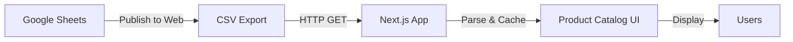

## Overview

Quality Hub GINEZ uses **Google Sheets** as the data source for its product catalog. This approach provides:
- ✅ Real-time updates without code deployment
- ✅ Familiar spreadsheet interface for non-technical users
- ✅ Easy collaboration on product data
- ✅ Version history and audit trail
- ✅ No database schema changes needed

The system consumes two separate sheets:
1. **Materia Prima (MP)** - Raw materials catalog
2. **Producto Terminado (PT)** - Finished products catalog

---

## Architecture



<Info>
  Data is fetched on-demand when users access the catalog. Consider implementing Next.js revalidation for production deployments.
</Info>

---

## Setup Instructions

### Step 1: Create Google Sheets

Create two separate Google Sheets for your product data:

<Steps>
  <Step title="Create Raw Materials Sheet">
    1. Go to [Google Sheets](https://sheets.google.com)
    2. Create new spreadsheet: "Quality Hub - Materia Prima"
    3. Add columns (see schema below)
  </Step>
  
  <Step title="Create Finished Products Sheet">
    1. Create another spreadsheet: "Quality Hub - Producto Terminado"
    2. Add columns (see schema below)
  </Step>
  
  <Step title="Populate Data">
    Fill in your product information following the schema requirements
  </Step>
</Steps>

---

### Step 2: Sheet Schema

Both sheets should follow this structure:

<CodeGroup>

```csv Required Columns
Codigo,Nombre,Familia,Categoria,Tipo,FichaTecnica,HojaSeguridad
```

```csv Example - Materia Prima
Codigo,Nombre,Familia,Categoria,Tipo,FichaTecnica,HojaSeguridad
ACIDO-CITRICO,Ácido Cítrico Anhidro,Acidulante,Químico,Materia Prima,https://drive.google.com/...,https://drive.google.com/...
ACIDO-SULFONICO,Ácido Sulfónico 96%,Tensioactivo,Químico,Materia Prima,https://drive.google.com/...,https://drive.google.com/...
ALQUIL-ETER,Alquil Éter Sulfato,Tensioactivo,Químico,Materia Prima,https://drive.google.com/...,https://drive.google.com/...
```

```csv Example - Producto Terminado
Codigo,Nombre,Familia,Categoria,Tipo,FichaTecnica,HojaSeguridad
LIMLIM,Limpiador Limón,Cuidado del Hogar,Limpiadores,Producto Terminado,https://drive.google.com/...,https://drive.google.com/...
TRALIM,Detergente Trastes Limón,Cuidado del Hogar,Detergentes,Producto Terminado,https://drive.google.com/...,https://drive.google.com/...
SUASUE,Suavizante Sweet,Lavandería,Suavizantes,Producto Terminado,https://drive.google.com/...,https://drive.google.com/...
```

</CodeGroup>

#### Column Definitions

<ParamField path="Codigo" type="string" required>
  **Product Code** - Unique identifier (e.g., "LIMLIM", "TRALIM")
  
  - Must be unique within the sheet
  - Used for matching with production records
  - Should match codes in `production-constants.ts`
</ParamField>

<ParamField path="Nombre" type="string" required>
  **Product Name** - Full descriptive name
  
  Example: "Limpiador Multiusos Limón 5L"
</ParamField>

<ParamField path="Familia" type="string" required>
  **Product Family** - High-level categorization
  
  Common values:
  - Cuidado del Hogar
  - Cuidado Personal
  - Lavandería
  - Línea Automotriz
  - Línea Antibacterial
  - Productos Intermedios
</ParamField>

<ParamField path="Categoria" type="string" required>
  **Product Category** - Specific product type
  
  Examples:
  - Limpiadores Multiusos
  - Detergentes para Trastes
  - Suavizantes de Telas
  - Jabones Líquidos
  - Shampoos
</ParamField>

<ParamField path="Tipo" type="string" required>
  **Type** - Material classification
  
  Values:
  - `Materia Prima` - Raw materials
  - `Producto Terminado` - Finished products
  - `Producto Intermedio` - Intermediate products
</ParamField>

<ParamField path="FichaTecnica" type="url" optional>
  **Technical Data Sheet URL** - Link to product specification PDF
  
  - Should be a Google Drive public link or direct download URL
  - Example: `https://drive.google.com/file/d/ABC123/view?usp=sharing`
  - Downloads are tracked in admin audit log
</ParamField>

<ParamField path="HojaSeguridad" type="url" optional>
  **Safety Data Sheet (SDS) URL** - Link to safety documentation
  
  - Should be a Google Drive public link or direct download URL
  - Critical for chemical products
  - Downloads are tracked in admin audit log
</ParamField>

---

### Step 3: Publish to Web

Each sheet must be published as CSV to generate the URL needed for the application.

<Steps>
  <Step title="Open Publish Dialog">
    In your Google Sheet:
    1. Click **File** → **Share** → **Publish to web**
  </Step>
  
  <Step title="Configure Publication">
    In the publish dialog:
    1. **Link tab**: Select the specific sheet/tab (e.g., "Sheet1")
    2. **Format**: Choose **Comma-separated values (.csv)**
    3. ✅ Check "Automatically republish when changes are made"
    4. Click **Publish**
  </Step>
  
  <Step title="Copy URL">
    Copy the generated URL. It should look like:
    ```
    https://docs.google.com/spreadsheets/d/e/2PACX-1vQxyz.../pub?gid=0&single=true&output=csv
    ```
  </Step>
  
  <Step title="Add to Environment">
    Add the URLs to your `.env.local`:
    ```env
    SHEET_MP_CSV_URL="https://docs.google.com/spreadsheets/d/e/.../pub?gid=123&single=true&output=csv"
    SHEET_PT_CSV_URL="https://docs.google.com/spreadsheets/d/e/.../pub?gid=456&single=true&output=csv"
    ```
  </Step>
</Steps>

<Warning>
  Make sure to select **CSV format**, not HTML. The URL must end with `output=csv`.
</Warning>

---

## Document Storage (Google Drive)

### Setting Up Document Links

The `FichaTecnica` and `HojaSeguridad` columns should link to PDF documents stored in Google Drive.

<Steps>
  <Step title="Upload Documents">
    1. Create a Google Drive folder: "Quality Hub - Documentos"
    2. Upload all technical data sheets and safety sheets as PDFs
    3. Organize in subfolders if needed (e.g., by product family)
  </Step>
  
  <Step title="Set Permissions">
    For each document:
    1. Right-click → **Share**
    2. Click **Change to anyone with the link**
    3. Set permission to **Viewer**
    4. Click **Copy link**
  </Step>
  
  <Step title="Add Links to Sheet">
    Paste the Google Drive links into the respective columns:
    ```
    https://drive.google.com/file/d/1ABC123xyz/view?usp=sharing
    ```
  </Step>
</Steps>

<Tip>
  Use descriptive filenames for PDFs (e.g., `FT-LIMLIM-2024.pdf`) to make management easier.
</Tip>

---

## Data Validation

Implement these validation rules in your Google Sheets:

### Required Field Validation

<CodeGroup>

```formula Codigo Validation
=AND(LEN(A2)>0, COUNTIF($A:$A, A2)=1)
```

```formula Familia Validation
=OR(
  A2="Cuidado del Hogar",
  A2="Cuidado Personal",
  A2="Lavandería",
  A2="Línea Automotriz",
  A2="Línea Antibacterial",
  A2="Productos Intermedios"
)
```

```formula URL Validation
=OR(
  ISBLANK(A2),
  AND(
    LEFT(A2,8)="https://",
    OR(
      ISNUMBER(SEARCH("drive.google.com", A2)),
      ISNUMBER(SEARCH("docs.google.com", A2))
    )
  )
)
```

</CodeGroup>

Apply these using **Data → Data validation** in Google Sheets.

---

## Syncing and Caching

### Current Behavior

```typescript
// Data fetched on page load (client-side)
const response = await fetch(process.env.SHEET_MP_CSV_URL)
const csvText = await response.text()
const products = parseCSV(csvText)
```

<Note>
  Current implementation fetches fresh data on every page load. This ensures data is always current but may impact performance.
</Note>

### Recommended Production Setup

For better performance, implement server-side caching:

<CodeGroup>

```typescript app/api/catalog/route.ts
import { NextResponse } from 'next/server'

export const revalidate = 300 // Revalidate every 5 minutes

export async function GET() {
  try {
    const [mpResponse, ptResponse] = await Promise.all([
      fetch(process.env.SHEET_MP_CSV_URL!, { next: { revalidate } }),
      fetch(process.env.SHEET_PT_CSV_URL!, { next: { revalidate } })
    ])
    
    const [mpData, ptData] = await Promise.all([
      mpResponse.text(),
      ptResponse.text()
    ])
    
    return NextResponse.json({
      materiaPrima: parseCSV(mpData),
      productoTerminado: parseCSV(ptData)
    })
  } catch (error) {
    return NextResponse.json(
      { error: 'Failed to fetch catalog' },
      { status: 500 }
    )
  }
}
```

```typescript Client Usage
// In your component
const { data, error, isLoading } = useSWR('/api/catalog', fetcher, {
  revalidateOnFocus: false,
  revalidateOnReconnect: false,
  refreshInterval: 300000 // 5 minutes
})
```

</CodeGroup>

<Tip>
  Adjust `revalidate` time based on how frequently your catalog changes. For stable catalogs, use 3600 (1 hour) or more.
</Tip>

---

## Troubleshooting

<AccordionGroup>
  <Accordion title="Error: Failed to fetch catalog data">
    **Possible causes**:
    1. Sheet not published to web
    2. Wrong URL format (not CSV)
    3. Sheet permissions too restrictive
    
    **Solution**:
    ```bash
    # Test URL directly in browser
    curl "YOUR_SHEET_URL" | head -20
    ```
    
    Should return CSV text, not HTML.
  </Accordion>
  
  <Accordion title="Products not showing in catalog">
    **Check**:
    1. CSV structure matches schema (headers in row 1)
    2. No empty required fields
    3. Encoding is UTF-8 (special characters display correctly)
    4. No duplicate `Codigo` values
    
    **Debug**:
    ```typescript
    console.log('Raw CSV:', await response.text())
    console.log('Parsed products:', products)
    ```
  </Accordion>
  
  <Accordion title="Document links not working">
    **Solutions**:
    1. Verify Google Drive link permissions ("Anyone with the link can view")
    2. Test links in incognito/private browser window
    3. Ensure URLs use `https://` (not `http://`)
    4. Check for trailing spaces in sheet cells
    
    **Fix bulk links**:
    ```
    =TRIM(A2) // Remove spaces
    =SUBSTITUTE(A2, "http://", "https://") // Fix protocol
    ```
  </Accordion>
  
  <Accordion title="Special characters (é, ñ, á) display incorrectly">
    **Cause**: Encoding issue
    
    **Solution**:
    1. Google Sheets should auto-publish as UTF-8
    2. In your fetch code, ensure:
    ```typescript
    const response = await fetch(url)
    const text = await response.text() // Automatically handles UTF-8
    ```
    
    3. If issues persist, manually specify:
    ```typescript
    const buffer = await response.arrayBuffer()
    const decoder = new TextDecoder('utf-8')
    const text = decoder.decode(buffer)
    ```
  </Accordion>
  
  <Accordion title="Changes not appearing in app">
    **If using caching**:
    1. Wait for revalidation period to expire
    2. Or manually clear cache:
    ```typescript
    mutate('/api/catalog') // If using SWR
    router.refresh() // If using Next.js App Router
    ```
    
    **If no caching**:
    1. Hard refresh browser (Ctrl+Shift+R)
    2. Verify sheet has "auto-republish" enabled
    3. Check published URL returns latest data
  </Accordion>
</AccordionGroup>

---

## Best Practices

<CardGroup cols={2}>
  <Card title="Data Governance" icon="shield-check">
    - Limit edit access to quality/product managers
    - Use protected ranges for critical columns
    - Maintain change log sheet for audit trail
  </Card>
  
  <Card title="Performance" icon="gauge-high">
    - Keep sheets under 10,000 rows for best performance
    - Use separate sheets for historical/archived products
    - Implement server-side caching for production
  </Card>
  
  <Card title="Data Quality" icon="check-double">
    - Use data validation rules
    - Standardize naming conventions
    - Regularly audit for duplicates or inconsistencies
  </Card>
  
  <Card title="Documentation" icon="book">
    - Include sheet instructions in first row (hide it)
    - Maintain README sheet with schema definitions
    - Document any custom formulas or validation rules
  </Card>
</CardGroup>

---

## Migration to Database (Optional)

For large-scale deployments, consider migrating catalog data to Supabase:

<Steps>
  <Step title="Create Catalog Table">
    ```sql
    CREATE TABLE catalogo_productos (
      id BIGSERIAL PRIMARY KEY,
      codigo TEXT UNIQUE NOT NULL,
      nombre TEXT NOT NULL,
      familia TEXT NOT NULL,
      categoria TEXT NOT NULL,
      tipo TEXT NOT NULL,
      ficha_tecnica TEXT,
      hoja_seguridad TEXT,
      created_at TIMESTAMPTZ DEFAULT NOW(),
      updated_at TIMESTAMPTZ DEFAULT NOW()
    );
    ```
  </Step>
  
  <Step title="Import Existing Data">
    Export CSV from Google Sheets and import:
    ```sql
    COPY catalogo_productos(codigo, nombre, familia, categoria, tipo, ficha_tecnica, hoja_seguridad)
    FROM '/path/to/export.csv'
    DELIMITER ','
    CSV HEADER;
    ```
  </Step>
  
  <Step title="Update Application">
    Replace CSV fetch with Supabase query:
    ```typescript
    const { data: products } = await supabase
      .from('catalogo_productos')
      .select('*')
      .order('nombre')
    ```
  </Step>
</Steps>

<Tip>
  Keep Google Sheets for initial setup and small deployments. Migrate to database when catalog exceeds 5,000+ products or requires complex queries.
</Tip>

---

## Next Steps

<CardGroup cols={2}>
  <Card title="Environment Variables" icon="gear" href="/configuration/environment-variables">
    Configure Google Sheets CSV URLs in your environment
  </Card>
  
  <Card title="Multi-Location" icon="location-dot" href="/configuration/multi-location">
    Learn about configuring production locations
  </Card>
</CardGroup>