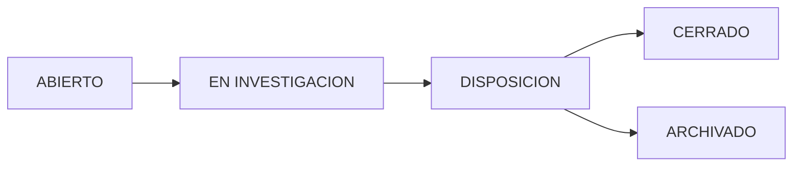

# Quality Control

The Quality Control module provides comprehensive tools for monitoring production quality, managing non-conformance reports (NCRs), and analyzing measurement history with visual conformity indicators.

## Overview

This module serves as the central hub for quality assurance activities, combining real-time conformity monitoring with structured NCR (Non-Conformance Report) workflows for defective batches.

## Module Structure

The Quality Control interface is organized into two main tabs:

<Tabs>
  <Tab title="NCR Management">
    Create, track, and resolve non-conformance reports for batches that fail quality standards.
  </Tab>
  <Tab title="Measurement History">
    View and analyze all production measurements with visual conformity indicators and filtering capabilities.
  </Tab>
</Tabs>

---

## NCR Management

### What is an NCR?

A **Non-Conformance Report (NCR)** is a formal documentation of a product defect or quality deviation. NCRs track:
- Defect parameters (pH, solids, appearance)
- Severity level
- Affected volume (liters)
- Root cause analysis
- Corrective actions
- Final disposition (rework, downgrade, scrap)

### NCR Workflow

<Steps>
  <Step title="Detection">
    Quality team identifies non-conforming batch from measurement history or production floor inspection.
  </Step>

  <Step title="Report Creation">
    Create NCR with:
    - Batch code reference
    - Defect parameter (pH / Sólidos / Apariencia)
    - Severity (MAYOR / MENOR / CRITICO)
    - Defect details
    - Liters involved
  </Step>

  <Step title="Investigation">
    Quality team:
    - Reviews measurements
    - Identifies root cause
    - Proposes corrective action
    - Communicates via comments
  </Step>

  <Step title="Disposition">
    Manager determines final action:
    - **REWORK**: Reprocess batch
    - **DOWNGRADE**: Sell as lower grade
    - **SCRAP**: Dispose batch
    - **APPROVE**: Release with deviation
  </Step>

  <Step title="Closure">
    NCR closed after:
    - Disposition executed
    - Recovered volume recorded
    - Corrective actions verified
  </Step>
</Steps>

### NCR Status Flow

<AccordionGroup>
  <Accordion title="ABIERTO (Open)" icon="folder-open">
    Newly created NCR awaiting initial review. Quality team must begin investigation.
  </Accordion>

  <Accordion title="EN INVESTIGACION (Under Investigation)" icon="search">
    Active investigation in progress. Root cause analysis and corrective action proposal underway.
  </Accordion>

  <Accordion title="DISPOSICION (Disposition)" icon="gavel">
    Manager has determined final action. Awaiting execution of disposition decision.
  </Accordion>

  <Accordion title="CERRADO (Closed)" icon="check-circle">
    NCR fully resolved. Disposition executed and corrective actions verified.
  </Accordion>

  <Accordion title="ARCHIVADO (Archived)" icon="archive">
    Historical record. No longer active but retained for audit trail.
  </Accordion>
</AccordionGroup>

### NCR Detail View

Clicking an NCR opens a comprehensive detail page (`/calidad/ncr/{id}`) showing:

**Header Information**
- NCR Number and Status Badge
- Creation Date and Author
- Batch Code with link to measurement
- Branch and Product
- Defect Parameter and Severity

**Defect Details**
- Liters Involved
- Defect Description
- Root Cause Analysis
- Reported Appearance (if applicable)

**Disposition Section**
- Disposition Type (Rework / Downgrade / Scrap / Approve)
- Liters Recovered
- Disposition Date
- Recovery Percentage Calculation

**Communication Timeline**
- Internal comments thread
- User avatars and timestamps
- Quality team collaboration

### Creating an NCR

**Prerequisites**: Non-conforming batch must exist in measurement history.

1. Navigate to **Quality Control > Measurement History**
2. Identify non-conforming batch (red badge)
3. Click batch row to open NCR creation dialog
4. Complete required fields:
   - Defect Parameter: pH / Sólidos / Apariencia
   - Severity: MAYOR / MENOR / CRITICO
   - Defect Detail: Description of defect
   - Liters Involved: Affected volume
5. Submit to create NCR

<Info>
  NCRs are automatically linked to the originating batch measurement for full traceability.
</Info>

---

## Measurement History

### Overview Table

The measurement history displays all production batches with visual quality indicators:

**Columns:**
- **Lote**: Batch code (font-mono format)
- **Producto/Sucursal**: Product code and branch
- **pH**: Measured value with reference range
- **% Sólidos (Avg)**: Average of two measurements with spec/tolerance limits
- **Estado**: Conformity badge (CONFORME / SEMI-CONFORME / NO CONFORME)
- **Apariencia**: Visual characteristics with expected standard
- **Fecha**: Manufacturing date
- **Preparador**: Preparer name (admin view only)
- **Acciones**: Edit/Delete buttons (admin only)

### Conformity Indicators

<CardGroup cols={3}>
  <Card title="CONFORME" icon="check-circle" color="#22c55e">
    Green badge indicates all parameters within specification.
    
    % Solids between red lines (spec min-max).
  </Card>

  <Card title="SEMI-CONFORME" icon="alert-circle" color="#eab308">
    Yellow badge indicates parameters within tolerance range.
    
    % Solids between yellow lines (±5% tolerance).
  </Card>

  <Card title="NO CONFORME" icon="x-circle" color="#C1272D">
    Red badge indicates parameters outside tolerance.
    
    % Solids beyond yellow tolerance limits.
  </Card>
</CardGroup>

### KPI Dashboard

At the top of the measurement history, four KPI cards display:

1. **Total Muestras** (Total Samples)
   - Count of all filtered records
   - Blue gradient card

2. **Total Conformes** (Total Conforming)
   - Count and percentage of conforming batches
   - Green gradient card
   - Shows FTQ (First Time Quality) metric

3. **Semi-Conformes** (Semi-Conforming)
   - Count and percentage of tolerance-range batches
   - Yellow gradient card

4. **No Conformes** (Non-Conforming)
   - Count and percentage of failing batches
   - Red gradient card
   - Triggers NCR creation

### Advanced Filtering

The measurement history includes comprehensive filters:

<Tabs>
  <Tab title="Search">
    Text search across:
    - Batch code (lote)
    - Product code
    - Branch name
    
    **Input**: Free-text field with search icon
  </Tab>

  <Tab title="Time Range">
    Date-based filtering:
    - Todo el historial (All)
    - Últimos 7 días (Last 7 days)
    - Últimos 30 días (Last 30 days)
    - Últimos 90 días (Last 90 days)
    
    **Based on**: `fecha_fabricacion` (manufacturing date)
  </Tab>

  <Tab title="Sucursal">
    Filter by branch location.
    
    **Admin only**: Regular users see only their branch.
    
    Options: All 40 GINEZ branches
  </Tab>

  <Tab title="Status">
    Filter by conformity level:
    - Todos los estados (All)
    - Conforme (Green)
    - Semi-Conforme (Yellow)
    - No Conforme (Red)
  </Tab>
</Tabs>

### Record Management

#### Editing Records (Admin Only)

Administrators can edit quality parameters:
- pH value
- Solids measurements (M1, M2)
- Appearance
- Color
- Aroma

<Warning>
  Batch code, product, and general information cannot be edited. Create a new record if fundamental data is incorrect.
</Warning>

#### Deleting Records (Admin Only)

Permanent deletion with cascade:
- Batch record removed
- Associated NCRs deleted
- NCR comments removed
- NCR dispositions removed

<Warning>
  Deletion is **permanent and irreversible**. A confirmation dialog prevents accidental deletion.
</Warning>

---

## Access Control

### Role-Based Permissions

<Tabs>
  <Tab title="Preparador (Operator)">
    **View**: Own records only
    
    **Actions**:
    - View measurement history (filtered to own batches)
    - Cannot create NCRs
    - Cannot edit or delete
  </Tab>

  <Tab title="Gerente Sucursal (Branch Manager)">
    **View**: All records from assigned branch
    
    **Actions**:
    - View measurement history (branch-filtered)
    - View NCRs for branch
    - Cannot edit or delete
  </Tab>

  <Tab title="Gerente Calidad (Quality Manager)">
    **View**: All records, all branches
    
    **Actions**:
    - Create NCRs
    - Investigate defects
    - Propose corrective actions
    - Comment on NCRs
    - Cannot delete records
  </Tab>

  <Tab title="Coordinador / Admin">
    **View**: All records, all branches
    
    **Actions**:
    - All Quality Manager permissions
    - Set NCR disposition
    - Edit any record
    - Delete records
    - Archive NCRs
  </Tab>
</Tabs>

---

## Mobile Responsiveness

The measurement history adapts to mobile devices:
- Desktop: Full table view with all columns
- Mobile: Card-based layout with key metrics
- Touch-optimized buttons
- Swipe-friendly filters

---

## Real-Time Updates

The module uses Supabase real-time subscriptions to auto-update:
- New batch measurements appear instantly
- NCR status changes reflected immediately
- No manual refresh required

<Info>
  The refresh button (top-right) forces a manual data reload if needed.
</Info>

---

## Best Practices

<AccordionGroup>
  <Accordion title="When to Create an NCR" icon="clipboard-list">
    Create an NCR when:
    - Batch shows red "NO CONFORME" badge
    - % Solids outside yellow tolerance lines
    - pH significantly out of specification
    - Appearance defects (separation, particles, turbidity)
    - Customer complaint received
  </Accordion>

  <Accordion title="Root Cause Analysis" icon="search">
    Investigate potential causes:
    - Raw material batch variation
    - Equipment calibration drift
    - Process parameter deviation
    - Operator training gap
    - Environmental conditions
  </Accordion>

  <Accordion title="Corrective Action" icon="wrench">
    Address root cause:
    - Immediate: Isolate affected batch
    - Short-term: Adjust process parameters
    - Long-term: Update procedures, retrain staff
    - Verification: Monitor next batches
  </Accordion>

  <Accordion title="Disposition Decision" icon="scale">
    Consider:
    - Severity of defect
    - Volume affected
    - Economic impact
    - Rework feasibility
    - Customer requirements
  </Accordion>
</AccordionGroup>

---

## Related Modules

- [Production Logbook](/modules/production-logbook) - Create new batch measurements
- [Reports & Analytics](/modules/reports-analytics) - Analyze quality trends
- [Product Catalog](/modules/product-catalog) - View product specifications