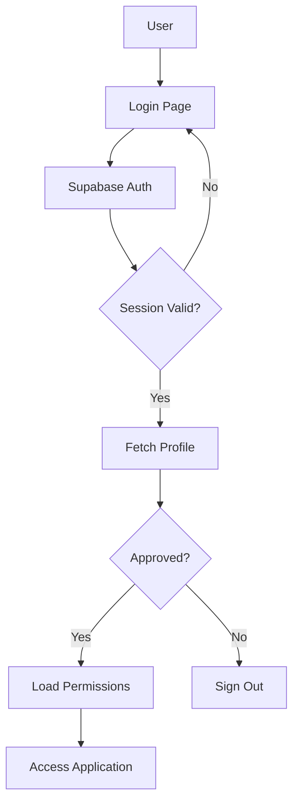

## Overview

Quality Hub GINEZ uses Supabase Authentication for secure user management. The authentication system includes session management, profile synchronization, approval workflows, and role-based access control.

## Authentication Architecture

### Components

The authentication system consists of three main components:

1. **AuthProvider** - React context provider for auth state management
2. **Supabase Auth** - Backend authentication service
3. **Profiles Table** - User metadata and role information

### Data Flow



## AuthProvider Implementation

The `AuthProvider` component manages authentication state across the application.

### Interface Definition

```typescript
interface Profile {
    id: string
    full_name: string
    area: string
    position: string
    role: string              // Role key (e.g., 'preparador', 'admin')
    is_admin: boolean
    approved: boolean         // Approval status
    sucursal?: string        // Branch assignment
    avatar_url?: string
}

interface AuthContextType {
    user: User | null          // Supabase user object
    profile: Profile | null    // User profile from profiles table
    session: Session | null    // Supabase session
    loading: boolean           // Auth state loading
    signOut: () => Promise<void>
}
```

### Core Features

#### Session Management

The provider checks for active sessions on initialization:

```typescript
const { data, error } = await supabase.auth.getSession()

if (data?.session) {
    setSession(data.session)
    setUser(data.session.user)
    await fetchProfile(data.session.user.id)
}
```

#### Profile Fetching

Profile data is retrieved from the `profiles` table:

```typescript
const { data: profileData, error } = await supabase
    .from('profiles')
    .select('*')
    .eq('id', userId)
    .single()
```

#### Approval Check

Users must be approved to access the system:

```typescript
if (!profileData.approved) {
    console.warn("User not approved, signing out.")
    await supabase.auth.signOut()
    return null
}
```

#### Auth State Changes

Real-time authentication state monitoring:

```typescript
supabase.auth.onAuthStateChange(async (event, session) => {
    console.log("Auth state change:", event)
    
    setSession(session)
    setUser(session?.user ?? null)
    
    if (session) {
        await fetchProfile(session.user.id)
    } else {
        setProfile(null)
        router.push('/login')
    }
})
```

### Usage

```typescript
import { useAuth } from '@/components/AuthProvider'

function MyComponent() {
    const { user, profile, loading } = useAuth()
    
    if (loading) return <Loader />
    
    if (!user) return <LoginPrompt />
    
    return (
        <div>
            <h1>Welcome, {profile?.full_name}</h1>
            <p>Role: {profile?.role}</p>
        </div>
    )
}
```

## Permissions System

The permissions system is built on top of authentication using the `usePermissions` hook.

### Permission Types

```typescript
export type AccessLevel = 'AC' | 'AP' | 'AR'

export interface ModulePermission {
    module_key: string
    access_level: AccessLevel
    can_view: boolean
    can_download: boolean
    can_create: boolean
    can_edit: boolean
    can_delete: boolean
    can_export: boolean
    available_filters: string[]  // Available filters for this role
    visible_tabs: string[]       // Visible tabs for this role
}
```

### usePermissions Hook

The hook fetches permissions based on the user's role:

```typescript
import { usePermissions } from '@/lib/usePermissions'

function BitacoraPage() {
    const { hasAccess, canCreate, loading } = usePermissions()
    
    if (loading) return <Loader />
    
    if (!hasAccess('bitacora')) {
        return <AccessDenied />
    }
    
    return (
        <div>
            <h1>Bitácora</h1>
            {canCreate('bitacora') && (
                <Button>Create Entry</Button>
            )}
        </div>
    )
}
```

### Permission Check Functions

#### Access Level Checks

```typescript
// Check if user has any access (not AR)
hasAccess(moduleKey: string): boolean

// Check for complete access (AC)
hasFullAccess(moduleKey: string): boolean

// Check for partial access (AP)
hasPartialAccess(moduleKey: string): boolean
```

#### Specific Permission Checks

```typescript
canView(moduleKey: string): boolean
canDownload(moduleKey: string): boolean
canCreate(moduleKey: string): boolean
canEdit(moduleKey: string): boolean
canDelete(moduleKey: string): boolean
canExport(moduleKey: string): boolean
```

#### Filter and Tab Checks

```typescript
// Check if a specific filter is available
hasFilter(moduleKey: string, filterKey: string): boolean

// Check if a specific tab is visible
canViewTab(moduleKey: string, tabKey: string): boolean

// Get all available filters
getAvailableFilters(moduleKey: string): string[]

// Get all visible tabs
getVisibleTabs(moduleKey: string): string[]
```

### Implementation Examples

#### Conditional Rendering Based on Access

```typescript
const { hasAccess } = usePermissions()

return (
    <div>
        {hasAccess('bitacora') && (
            <Link href="/bitacora">Bitácora</Link>
        )}
    </div>
)
```

#### Conditional Filters

```typescript
const { hasFilter } = usePermissions()

return (
    <div>
        {/* Only Admin sees branch filter */}
        {hasFilter('reportes', 'sucursal') && (
            <Select>
                <SelectTrigger>Branch</SelectTrigger>
                <SelectContent>
                    {SUCURSALES.map(s => (
                        <SelectItem key={s} value={s}>{s}</SelectItem>
                    ))}
                </SelectContent>
            </Select>
        )}
        
        {/* All users see category filter */}
        {hasFilter('reportes', 'categoria') && (
            <CategoryFilter />
        )}
    </div>
)
```

#### Conditional Tabs

```typescript
const { canViewTab } = usePermissions()

return (
    <Tabs>
        <TabsList>
            <TabsTrigger value="calidad">Quality Control</TabsTrigger>
            
            {/* Only Admin sees Commercial Analysis tab */}
            {canViewTab('reportes', 'analisis_comercial') && (
                <TabsTrigger value="comercial">
                    Commercial Analysis
                </TabsTrigger>
            )}
        </TabsList>
        
        <TabsContent value="calidad">
            <QualityControlTab />
        </TabsContent>
        
        {canViewTab('reportes', 'analisis_comercial') && (
            <TabsContent value="comercial">
                <CommercialAnalysisTab />
            </TabsContent>
        )}
    </Tabs>
)
```

#### Action Buttons Based on Permissions

```typescript
const { canCreate, canEdit, canDelete } = usePermissions()

return (
    <div className="flex gap-2">
        {canCreate('bitacora') && (
            <Button onClick={handleCreate}>Create</Button>
        )}
        
        {canEdit('bitacora') && (
            <Button onClick={handleEdit}>Edit</Button>
        )}
        
        {canDelete('bitacora') && (
            <Button variant="destructive" onClick={handleDelete}>
                Delete
            </Button>
        )}
    </div>
)
```

## Database Functions

### get_user_permissions_v2

SQL function that retrieves permissions based on user role:

```sql
CREATE FUNCTION get_user_permissions_v2(p_user_id UUID)
RETURNS TABLE (
    module_key TEXT,
    access_level TEXT,
    can_view BOOLEAN,
    can_download BOOLEAN,
    can_create BOOLEAN,
    can_edit BOOLEAN,
    can_delete BOOLEAN,
    can_export BOOLEAN,
    available_filters JSONB,
    visible_tabs JSONB
)
```

Usage:

```typescript
const { data, error } = await supabase
    .rpc('get_user_permissions_v2', { p_user_id: user.id })
```

## Registration Flow

### New User Registration

1. User fills registration form with:
   - Full name
   - Email
   - Password
   - Role selection
   - Branch selection

2. Account created in `auth.users`

3. Profile created in `profiles` table with `approved = false`

4. User redirected to pending approval page

### Administrator Approval

1. Admin navigates to **Configuration → Users**

2. Pending users shown with amber badge

3. Admin clicks **Approve** button

4. User can now log in and access the system

### Automatic Permission Assignment

Permissions are automatically assigned based on the selected role. No manual permission configuration is required.

## Sign Out Flow

```typescript
const signOut = async () => {
    console.log("Signing out...")
    try {
        const { error } = await supabase.auth.signOut()
        if (error) throw error
    } catch (e) {
        console.error("Error signing out:", e)
    } finally {
        setUser(null)
        setProfile(null)
        setSession(null)
        router.push('/login')
        router.refresh()
    }
}
```

## Security Best Practices

### Row Level Security (RLS)

Supabase RLS policies control data access:

```sql
-- Anyone can view roles
CREATE POLICY "Anyone can view roles v2" 
ON user_roles_v2 FOR SELECT USING (TRUE);

-- Anyone can view access levels
CREATE POLICY "Anyone can view access levels" 
ON module_access_levels FOR SELECT USING (TRUE);
```

### Protected Routes

Pages check authentication status:

```typescript
if (loading) return null

if (!user) {
    return (
        <div className="p-8 text-center">
            Please log in to access this page.
        </div>
    )
}
```

### Session Persistence

Sessions are persisted in browser storage and automatically refreshed.

## Error Handling

### Session Errors

Abort errors in development mode are safely ignored:

```typescript
if (error.message && error.message.includes('AbortError')) {
    console.warn("Session check aborted (harmless in dev)")
    return
}
```

### Profile Fetch Errors

Profile fetch failures are logged but don't crash the app:

```typescript
if (error) {
    console.error("Error fetching profile:", error)
    return null
}
```

## Testing Authentication

### Check Current User

```typescript
const { user, profile } = useAuth()

console.log('User ID:', user?.id)
console.log('Email:', user?.email)
console.log('Role:', profile?.role)
console.log('Approved:', profile?.approved)
```

### Check Permissions

```typescript
const permissions = usePermissions()

console.log('All permissions:', permissions.permissions)
console.log('Can view bitacora:', permissions.canView('bitacora'))
console.log('Can create entries:', permissions.canCreate('bitacora'))
```

## Troubleshooting

### User Cannot Log In

1. Check if user is approved in `profiles` table
2. Verify email/password are correct
3. Check browser console for auth errors

### Permissions Not Loading

1. Verify user has a role assigned in `profiles` table
2. Check that role exists in `user_roles_v2` table
3. Verify permissions exist in `module_access_levels` for that role

### Session Expired

Sessions are automatically refreshed. If issues persist:

1. Clear browser cache and cookies
2. Log out and log back in
3. Check Supabase session configuration

## API Reference

### AuthProvider

```typescript
import { useAuth } from '@/components/AuthProvider'

const { user, profile, session, loading, signOut } = useAuth()
```

### usePermissions

```typescript
import { usePermissions } from '@/lib/usePermissions'

const {
    permissions,
    loading,
    hasAccess,
    canView,
    canCreate,
    canEdit,
    canDelete,
    hasFilter,
    canViewTab
} = usePermissions()
```

For detailed role and permission information, see the [Roles and Permissions](/user-management/roles-permissions) page.
